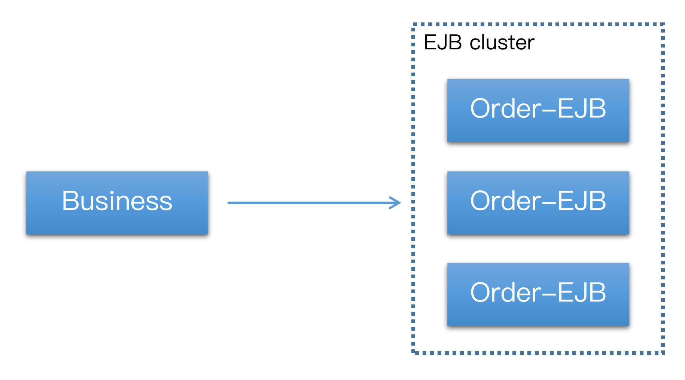

# EJB集群演示

## 测试场景



创建应用服务器集群`mycluster`，将`order-ejb`部署到集群中：

```
./asadmin deploy --force=true --availabilityenabled=true --asyncreplication=true --target mycluster ~/order-ejb.jar
```

然后将`business-ear`应用部署到集群外的一台应用服务器，该应用会远程访问`order-ejb`。

我们通过浏览器或其他HTTP客户端访问`business-ear`：

```
http://host:port/business-web/resource/business/createOrder?userId=[userId]&commodityCode=[code]&count=[count]
```

## 远程访问EJB集群

`Business`应用要远程访问部署在集群的中`order-ejb`，需要在构建`InitialContext`时指定`iiop.endpoints`：

```
Properties properties = new Properties();
properties.put("com.sun.appserv.iiop.endpoints", "172.20.140.11:23700,172.20.140.12:23700");
InitialContext ic = new InitialContext(properties);
orderService = (OrderService) ic.lookup("java:global/order-ejb/OrderServiceBean");
```

`iiop.endpoints`中指定的节点列表是在创建`InitialContext`时使用，理论上只需要设置集群中的任意一个节点即可，客户端便能获得集群的其他节点，并自动感知集群的变化（新增和移除节点），然后更新所持有的节点列表。不过一般建议在`iiop.endpoints`中至少需要设置集群中的两个节点，以备在其中一个节点失败时可以进行`failover`。

## EJB集群的负载均衡和failover

单个客户端通过`InitialContext`获取的`EJBHome`位于同一目标服务器上，由于所有客户端在创建`InitialContext`时都会将当前可用的节点列表随机打乱，因此多个客户端对EJB集群的访问有效的实现了负载均衡。

当集群中的某个节点失效时，如果客户端获取的`EJBHome`在这个节点，随后对EJB的访问将自动转到其他节点，`IIOP`的`failover`对客户端来说是透明的。

我们可以在集群的其他节点上通过服务器日志观察到成员的变化信息。例如某个节点失效，会收到如下信息：

```
GMS1017: Received PlannedShutdownEvent Announcement from member: instance-3 with shutdown type: INSTANCE_SHUTDOWN of group: mycluster]]
GMS1008: Sending PlannedShutdownSignals to registered Actions for shutdownType INSTANCE_SHUTDOWN member: instance-3 ...]]
```

当失效节点恢复时，会收到如下信息：

```
GMS1016: Analyzing new membership snapshot received as part of event: JOINED_AND_READY_EVENT for member: instance-3 of group: mycluster]]
GMS1025: Adding Joined And Ready member: instance-3 group: mycluster StartupState: INSTANCE_STARTUP ]]
```

`IIOP`的负载均衡和`failover`支持集群的动态变更，因此，如果在集群中添加或删除节点，客户端不需要手动更新可用服务器列表。